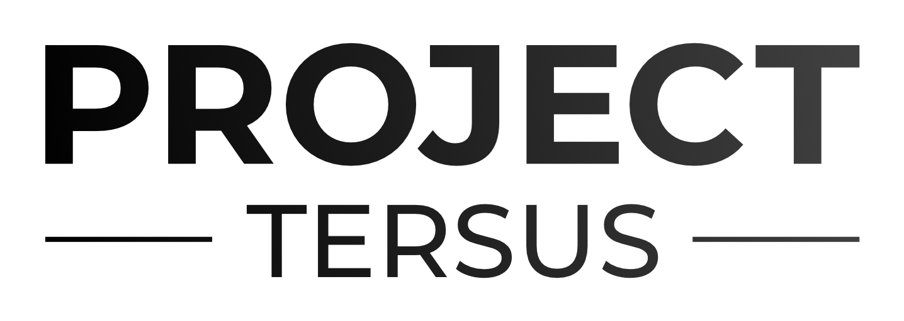

# CE299 - Team 5

- [Team Members](#team-members)
- [Initial Project Ideas](#initial-project-ideas)
- [Stretch Goals](#stretch-goals)
- [Research Materials](#research-material)
- [Useful Links](#useful-links)

## Meetings

- [Meeting 1 - Week 4](./documents/meetings/2020-10-30.md)
- [Meeting 2 - Week 5](./documents/meetings/2020-11-06.md)

## Team Members
|Name|Development Area|Skills|Languages|
|----|----------------|------|---------|
|Arif Meighan|Front-end / webdev|Regression analysis algorithms|Python / Java|
|Alex Newson|Front-end / Back-end| |Python / Java|
|Knut Sander Lien Blakkestad|Back-end| |Python / Java|
|Samual Engel|Back-end|Databases & Infrastructure|Python / Java|
|Adam Duarte-Dias|Front-end design|Design & Analysis|C / C++ / Python / Java|
|Hazim Mohamed-Khan|Front-end / Back-end|Design & Analysis|Python / Java|
|Andrei Alexandru Talpan| Front-End/ Back-end| |Python / Java|

## Initial Project Ideas
### Webserver with a monitoring system (software)
* Regression Analysis with employee data e.g. correlating sick days and hand sanitizer data
* Statistical model for detecting teams or groups of people that don't sanitize hands often enough (AI?)
* Customizable reporting of different metrics related to hand hygiene
* Mobile app to alert users to danger within workplace/hand hygiene count
* Epidemology simulation, method to simulate the workspace disease spread in case of infection spread. (plague inc)
    * Could Implement Gamification based on user infection spread/handwash rate and encourage behavioural changes.

### Behavioural Modification (hardware/software)
* Gamification elements to encourage behaviour modification e.g. score system, penalty points, leaderboard
* Notifications to users to encourage hand washing frequency
* Use of lights/display to indicate correct time/technique to wash hands (ALA child toothbrushes that light up for timing)
* Use of some near field communications to detect time spent washing hands?

### Hand gesture recognition for time based washing (hardware/software)
* Camera for ensuring correct hand washing technique
    * Real time colour recognition to detect skin colour for measuring time spent washing
    * Or instead using Hyperspectral imaging to detect presence of human skin, avoiding racial bias
    * Advanced AI recognition for techniques (could be too advanced, something we talk about for the future of the project)
* Other sensors to detect hand washing duration etc.

### Wireless collection of sanitizer data via RFID or other technology (hardware)
* Using existing employee RFID cards
* Using NFC by linking a mobile phone with the hand sanitizing station

## Stretch Goals
### Security & Encryption
- Implementing SSL
- Creating users on Django
- Improving server security
  - Removing external DB connections
  - SSH Keys
  - Firewalls

### Dashboard Development
- Create a table within dashboard to display hand sanitising stations
- Staff can log in and view their own stats

### Machine Learning & Clustering
- Warning system for departments, e.g. high risk alerts
- Anomaly detection

### Productization
- Create Branding
- Manufacturing Costs and Process
- Market Research

### Gamification
- Point based system
- Redeem rewards

## Research Material
- [Analytic Research](./documents/research/AnalyticResearch.md)
- [Existing Systems](./documents/research/ExistingSystems.md)
- [Technologies](./documents/research/Technologies.md)

## Useful Links
[Markdown Reference](https://guides.github.com/features/mastering-markdown/)  
[Final Presentation Storyboard](https://www.figma.com/file/7BQ0EIr4uBWtUoj6kvwzRS/Storyboard?node-id=0%3A1)  
[Final Presentation Slides](https://docs.google.com/presentation/d/14G-5l0RYkb4H-KW5UJyBgG8GRHa1G7AqS2kD-xUcTTM/edit#slide=id.gbffa7c302e_0_6)  
