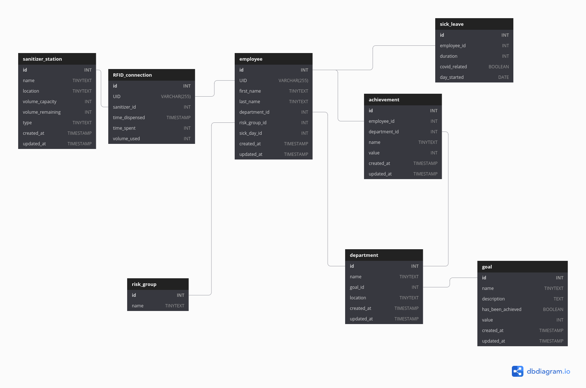

# MySQL relational database

## Diagram 
Check the links below for most up-to-date version

## Live links
You can not collaboratively edit the online diagram but you can fork it, make changes and share the link to the newest version. 

- [Version 1](https://dbdiagram.io/d/5fa867ba3a78976d7b7b04ee)
- [Version 2](https://dbdiagram.io/d/5faae5183a78976d7b6b57aa)
- [Version 3](https://dbdiagram.io/d/5faae5183a78978d7b7b57aa)
- [Version 4](https://dbdiagram.io/d/5faae5183a78976d7b7b57aa)

## TODO

- ~~What statistical metrics are we measuring?~~
- ~~Industry specific measures for each employee~~
- ~~How sophisticated sanitizer dispenser? Tracking how much sanitizer left vs
  whether or not it is empty.~~
- ~~RFID specific fields besides UID~~ 
