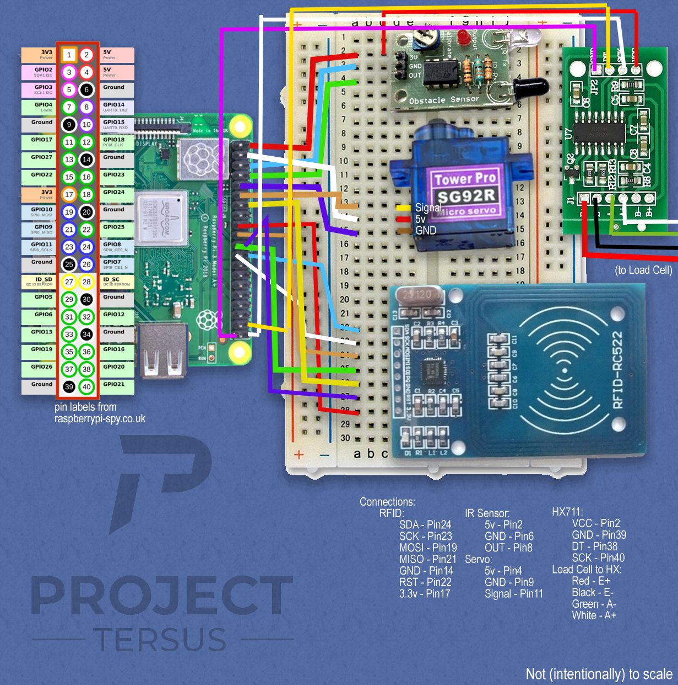
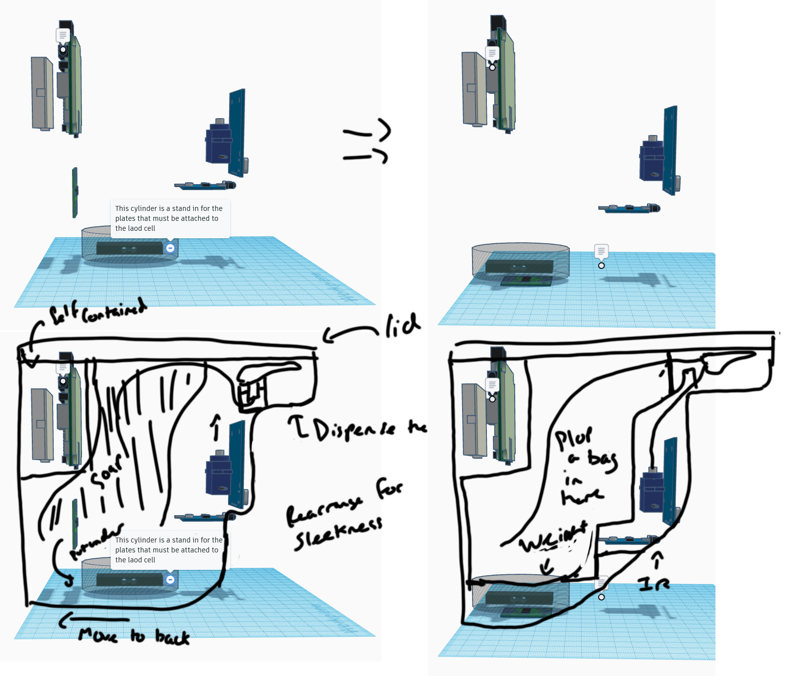
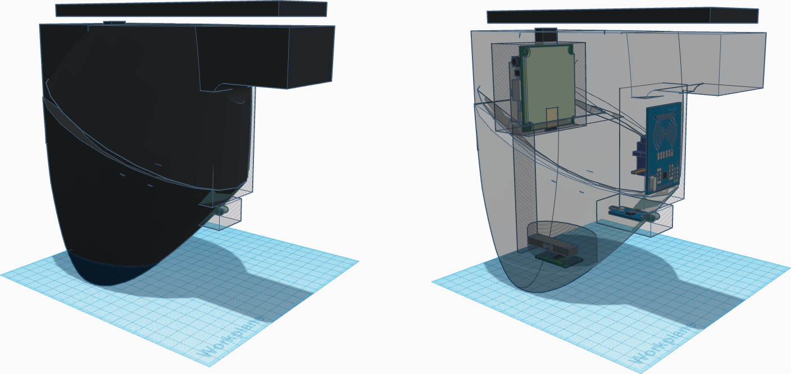
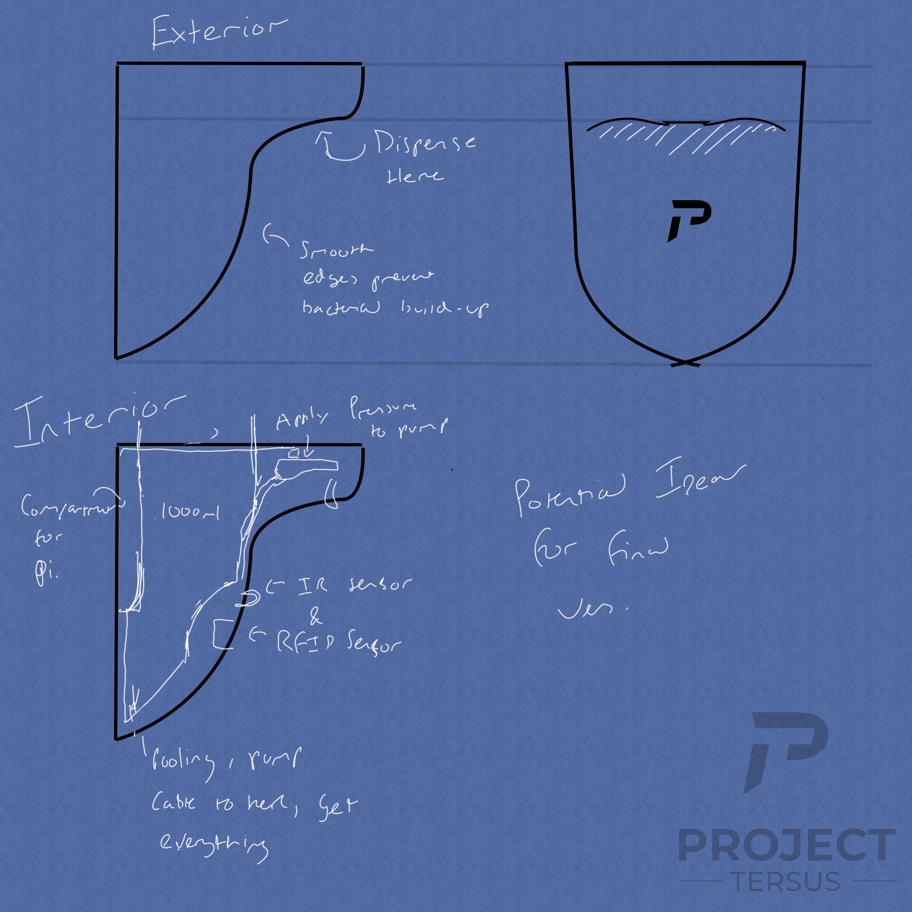
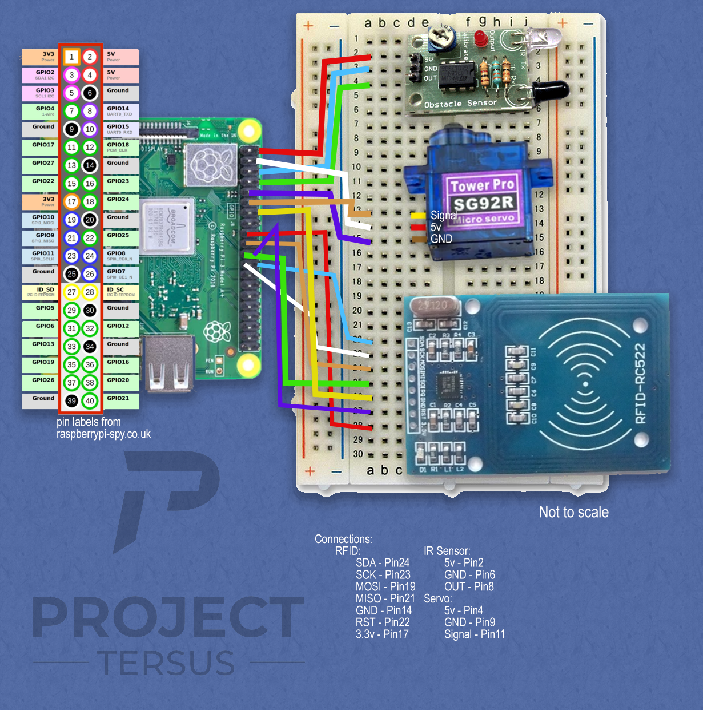

# Blueprinting Hardware Designs

## 3D Modelling  (Update 3)

After practixing with Blender, I've created a casing for the dispeser that can be 3D printed once converted to the relevant format - I animated it a little to make it clear where things will go.
This can be seen [here](3DRender.avi).  
The video shows the whole of the case, and how it will be seperated for the components. 

## Blueprints 1.5 (Update 2)  

Now attempting to create a 3D model as a design, and incorporate a weight sensor to detect how much soap/alcohol is left in the dispenser.
Using tinkerCAD and pre-existing models I am able to form an accurate size representation of the components in questions and shape the 3D casing around this.
Following [this guide](https://tutorials-raspberrypi.com/digital-raspberry-pi-scale-weight-sensor-hx711/) we can create a scale that can weight up to 1kg. The load cell requires being attached to two plates - one above and below. This could sit at the bottom of the casing in order to accurately determine the remaining solution.
Using the to scale 3D models, I can create a more accurate hardware design. The only non-existing component is the HX711 load cell amplifier, so I have modelled a very rough version of this in tinkerCAD and these models can be seen [here](3Dcomponents.png).

### Regarding the weight sensor:  
The weight sensor requires 5v, but the two 5vs are already taken.  
Plus, in terms of current, It seems that [you should only draw 16mA from a single pin](https://www.scribd.com/doc/101830961/GPIO-Pads-Control2), and the max draw in total is 50mA; the [HX711 seems to draw 1.5mA](https://datasheetspdf.com/pdf/842201/Aviasemiconductor/HX711/1), the [RC522 seems to draw between 13mA and 26mA](https://www.hobbytronics.co.uk/mfrc522-reader), the Infrared Sensor draws 20mA (see the datasheet above), and the [Servo seems to draw up to 650mA!](https://opencircuit.shop/Product/TowerPro-SG90-9G-micro-servo-motor-180).  
I am unsure what this means in terms of the limits as it would appear the IR sensor alone would be too much current, let alone the Servo motor (though it could just result in a weaker motor - must check if the ). I must get in contact with someone who knows more about the limits of the Raspberry Pi.  
Perhaps this means an external power suppy is required?  
In the mean time, the circuit below will be drawn under the impression that sharing a pin with the Servo would be too much, but the IR sensor might be fine. Hopefully.

Working on a 3D model for the case, I've planned the shape by drawing over the 3D components to get a better feel for the planned shape:  
  

I have attempted to create a 3D model for the  case in tinkerCAD, but in order to design the unique shape of our product, I believe I'll have to learn some more modeling skills in blender or the like;  
It's rather difficult to mould the shape by cutting it out of other shapes in the tools provided, so below is a 3D rough estimate of how the casing will look.  
  
Despite the roughness of the model, it is atleast clear that the components should be able to fit in this design of the enclosure, with plenty of room for a cleaning solution.

3D Models used under [Attribution-ShareAlike 3.0 Unported (CC BY-SA 3.0)](https://creativecommons.org/licenses/by-sa/3.0/) :
Breadboard Mini provided by TinkerCAD
[Raspberry Pi 3 Model A+ created by mborrega79](https://www.tinkercad.com/things/jZ6JeAgUoSQ)  
[Tower Pro Micro Servo SG90 (9g) created by FuaZe](https://www.tinkercad.com/things/h2TwcJpKSDK)  
[Arduino RFID-RC522 created by Gonzalo Bolaños León](https://www.tinkercad.com/things/gF02QGXEmCW)  
[Load Cell 1kg created by Jürgen](https://www.tinkercad.com/things/1CUvI6ebcuy)  
[IR Sensor created by Patrick Darbin.](https://www.tinkercad.com/things/ibiTyYsVHI9)  
[HX711 created by Adam Duarte-Dias](https://www.tinkercad.com/things/h34nftgiVi4)  

## Blueprints 1.0 (Initial)
## Hardware and their Sizes
[Raspberry Pi 3 A+](https://www.raspberrypi.org/app/uploads/2018/11/Raspberry_Pi_3A_mechanical-drawing.pdf) - 65mm x 56mm x 8.5mm

[RC522 RFID Module 13.56MHz](https://www.hobbytronics.co.uk/mfrc522-reader) - 60mm x 39mm

[IR Sensor](https://components101.com/sites/default/files/component_datasheet/Datasheet%20of%20IR%20%20Sensor.pdf) - 50mm x 20mm x 10mm

[Servo Motor](http://www.towerpro.com.tw/product/sg92r-7/) - 23mm x 12.2mm x 27mm

[1000ml box](https://www.amazon.co.uk/Plastic-Microwave-Container-1000ml-quantity/dp/B006VDLZO0) - 645mm x 376mm x 259mm

## Thoughts
Perhaps we could have a top dispensing hand sanitizer instead of a bottom.
Pressure could be applied to a simple pump in our own container rather than a botttle.
Illustration ideas below:

## Prototype Design
However, before we get to the above stage, we need to test whether the physical implementation can work.
Below is a planned test to see if the implementation is feasible.
The Rasbperry Pi must connect to the RFID Sensor, the IR Sensor, a motor to push a soap dispensor pump.
We could also test whether we can measure how much content remains in the dispensor during this test w/ a scale.
The test would be succesful if a RFID badge can trigger the soap dispensing.
Currently, pushing the pump will be performed by a servo motor pulling a connection to the pump down.
--Perhaps another method can be used?

Hardware-wise, the software works as follows:
When an RFID signal is detected, the servo motor should recieve a signal that causes it to turn and pull a string that dispenses the soap. 
The program then logs how long the IR sensor is disturbed for to determine how long the user washed their hands for.

Planned Circuitry Based on:

[How to setup a Raspberry Pi RFID RC522 Chip](https://pimylifeup.com/raspberry-pi-rfid-rc522/)

[Add Infared Sensor to Raspberry Pi GPIO](https://circuitdigest.com/microcontroller-projects/raspberry-pi-ir-sensor-tutorial)

[How to Use a Servo Motor with Raspberry Pi](https://www.youtube.com/watch?v=ZgURwWJaOZw)

<<<<<<< HEAD
=======
## Blueprints 1.5

Now attempting to create a 3D model as a design, and incorporate a weight sensor to detect how much soap/alcohol is left in the dispenser.
Using tinkerCAD and pre-existing models I am able to form an accurate size representation of the components in questions and shape the 3D casing around this.
Following [this guide](https://tutorials-raspberrypi.com/digital-raspberry-pi-scale-weight-sensor-hx711/) we can create a scale that can weight up to 1kg. The load cell requires being attached to two plates - one above and below. This could sit at the bottom of the casing in order to accurately determine the remaining solution.
Using the to scale 3D models, I can create a more accurate hardware design. The only non-existing component is the HX711 load cell amplifier, so I have modelled a very rough version of this in tinkerCAD and these models can be seen [here](3Dcomponents.png).

### Regarding the weight sensor:  
The weight sensor requires 5v, but the two 5vs are already taken.  
Plus, in terms of current, It seems that [you should only draw 16mA from a single pin](https://www.scribd.com/doc/101830961/GPIO-Pads-Control2), and the max draw in total is 50mA; the [HX711 seems to draw 1.5mA](https://datasheetspdf.com/pdf/842201/Aviasemiconductor/HX711/1), the [RC522 seems to draw between 13mA and 26mA](https://www.hobbytronics.co.uk/mfrc522-reader), the Infrared Sensor draws 20mA (see the datasheet above), and the [Servo seems to draw up to 650mA!](https://opencircuit.shop/Product/TowerPro-SG90-9G-micro-servo-motor-180).  
I am unsure what this means in terms of the limits as it would appear the IR sensor alone would be too much current, let alone the Servo motor (though it could just result in a weaker motor - must check if the ). I must get in contact with someone who knows more about the limits of the Raspberry Pi.  
Perhaps this means an external power suppy is required?  
In the mean time, the circuit below will be drawn under the impression that sharing a pin with the Servo would be too much, but the IR sensor might be fine. Hopefully.

Working on a 3D model for the case, I've planned the shape by drawing over the 3D components to get a better feel for the planned shape:  
  

I have attempted to create a 3D model for the  case in tinkerCAD, but in order to design the unique shape of our product, I believe I'll have to learn some more modeling skills in blender or the like;  
It's rather difficult to mould the shape by cutting it out of other shapes in the tools provided, so below is a 3D rough estimate of how the casing will look.  
  
Despite the roughness of the model, it is atleast clear that the components should be able to fit in this design of the enclosure, with plenty of room for a cleaning solution.

3D Models used under [Attribution-ShareAlike 3.0 Unported (CC BY-SA 3.0)](https://creativecommons.org/licenses/by-sa/3.0/) :  
Breadboard Mini provided by TinkerCAD  
[Raspberry Pi 3 Model A+ created by mborrega79](https://www.tinkercad.com/things/jZ6JeAgUoSQ)  
[Tower Pro Micro Servo SG90 (9g) created by FuaZe](https://www.tinkercad.com/things/h2TwcJpKSDK)  
[Arduino RFID-RC522 created by Gonzalo Bolaños León](https://www.tinkercad.com/things/gF02QGXEmCW)  
[Load Cell 1kg created by Jürgen](https://www.tinkercad.com/things/1CUvI6ebcuy)  
[IR Sensor created by Patrick Darbin.](https://www.tinkercad.com/things/ibiTyYsVHI9)  
[HX711 created by Adam Duarte-Dias](https://www.tinkercad.com/things/h34nftgiVi4)  
>>>>>>> 9d9c88db0050455ebc03558e90918abe10ad1d65

