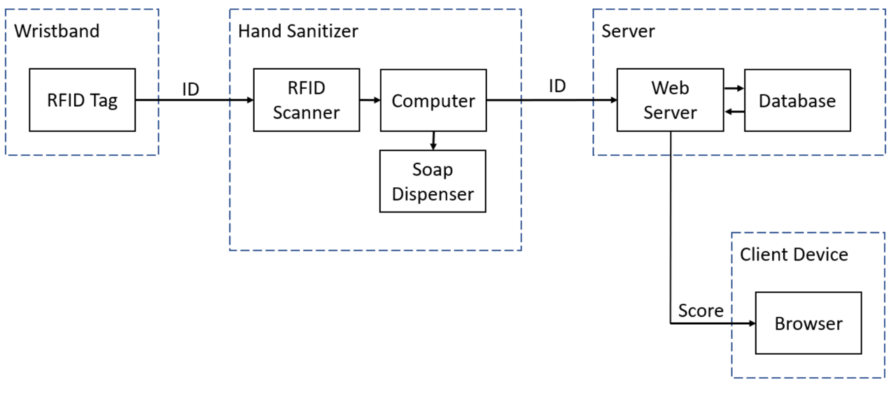

# Marketing Plan
Below lays out the marketing plan for 'Project Tersus' (Team 5). 

## Market Research
Before developing our product, the current landscape of the market needed to be analysed; through the use of the team's personal knowledge, business contacts and research conducted by third parties, a gap was found in the market that calls for a cheap, sustainable, and reliable hand sanitisation product that can decrease risk in critical health sectors.

### Primary Research
The initial pitch took place via communication with the team's primary business contact, Dick Wallis from Position Systems Limited.

Dick proposed the development of a new hand-sanitising product to improve upon the existing archaic design. It was noted through the flaws of the current product that a quick, seamless, and scalable experience was a necessary replacement. However, other systems currently available on the market were too expensive.

### Secondary Research
This knowledge led to further research on smart sanitisation and how a new product could fit into the already-developing market.

A variety of unique systems were found, using technology ranging from Ultra-violet (UV) [^1] and Infrared (IR)[^2] [^3] light, to Real Time Location Systems (RTLS)[^4]; these potential products proposed an accurate way of tracking sanitisation, however, at a large cost to the consumer.

With this research, the product was designed in such a way to preserve the accuracy of these expensive systems whilst keeping costs to the consumer minimal.

## Economics
Market Analysis showed the need for smart, accurate hand sanitisation stations within the current UK health care system.

Within the Public Sector (NHS) there are over 1,250 hospitals that employ over 1.3 million staff. On a typical day, the NHS handles about 50,000 A&E patients and 36,000 patients in hospital for planned treatment.[^5] Around 12% of the population[^6] were also registered for private health care. Using these statistics, a large demand for hand sanitising products can be seen, regardless of their smart features.

Currently, almost all healthcare buildings in the UK have some sort of hand sanitisation arrangement in place, however very few have a smart system implemented into their buildings; the main contributing factor behind this could be the high cost of these already existing systems.

A cheap and accurate system that provides effective sanitisation should see high demand and corner a large portion of the market, with demand only set to increase over time. The current climate of the health care system during a pandemic has only further highlighted the need for a quick way of highlighting risks and reducing them in an accurate, time efficient manner.

However, entry into the market could provide quite challenging, with Dick Wallis' personal experience showing that trying to deploy a new product within the public health sector of the UK is near enough impossible without an established product with experience to back it up.

From this, it can be determined that the product is best suited to initially target the private sector with a smaller percentage of the market share. Another barrier to entry is the privacy implications of a smart system that tracks individuals: for example, this could lead to opposition from worker's unions who would be against the singling out of employees.

## Product, Price, Promotion, Place
### Product
The project aims to deliver a cheap, smart hand sanitisation system that uses low-cost parts working in tandem with software hosted on a server to alert health care managers of potential risks.

To achieve this, the product will use a small microprocessor embedded into the wall-mounted hand sanitiser with an RFID chip to monitor staff of how frequent they are using the machines.

 
*Figure 1: Initial Draft of 3D model casing.*  
 
Machine learning on the data on the server categorises staff into risk categories and displaying all of this critical information on an easy to navigate dashboard that can be accessed anywhere in the health care building.

*Figure 2: System Architecture.*  

Purchasing the product would also include sustainable updates to the software with constant support lines for consumers.

### Price
The cost of manufacturing the product is fairly low compared to competitors, costing around £75 per unit (this figure doesn't consider volume discounting, cheaper manufacturing processes in other countries and shipping costs).

The aim is to sell each unit at near-cost price (\~£100) with the majority of profits coming from the server software under a subscription model. This would ensure a constant cash flow from customers and ensure constant upkeep and development of the software.

The base cost of the subscription would be £500/month with an extra £15/station/month.

Eventually a cheaper model could be offered that allowed consumers to upgrade existing hand sanitisation systems to Project Tersus at a reduced cost.

In the future, an enterprise licence will also be provided at a reduced, one-time cost that allows consumers to host the software on their servers with updates for a set number of years after the initial purchase, however support will be more scarce.

Overall, for a company to deploy 20 stations over a year, it would cost them £2,000 for the stations and £11,600 for subscriptions. The high yearly price is justified by how the product can drastically decrease the customers' expenditure in sick pay as our product can help them effectively manage and reduce disease transmission.

### Promotion
After gathering a substantial base of customers with a constant cash flow, a discount code can be provided for long-term customers to continue purchasing our hardware at a reduced cost, encouraging the expansion of their smart sanitising system whilst creating further reliance on the software provided in the subscription. It will also encourage the purchasing of any new products from the team due to building a good reputation and relationship with the consumer.

### Place
The initial deployment of products would aim to be in the private sector as there is less resistance from a staff hierarchy (like in the public sector), and as such it is much more likely customers will purchase the product.

This substantial base of customers, previous knowledge and experience can then be used to target the public sector, with the aim being a contract for the system to be implemented in x number of hospitals around the UK.

## Customers
The main demographic for this product is health care system managers who look after the amenities of a building and would like to reduce the potential risk of infections and denies transmission.

## Competition
Throughout the development of the hand sanitising product, research was performed on competitors that provided similar and unique products:

### SAVORTEX
The main competitor is a company called SAVORTEX who provide a very similar system,[^7] however their flagship product includes a built-in HD video screen that drastically increases the cost of their product. Their dashboard system also provides a very basic view of the usage of their products and provide no machine learning and predictive algorithms to prevent further risk.

Project Tersus aims to challenge this via lower cost of the initial hardware and providing a more insightful dashboard for customers.

### Keonn
Another competitor is a company called Keonn; their system provides a staff member to tap their ID card on the dispenser. This could be perceived as a clunky system that requires the user to fumble around with their badge and quickly put it away to catch the dispensing gel. They don't talk about costing on their website. [^8]

Project Tersus would combat this by utilising RFID chips embedded into bracelets, so the user can scan and catch the gel all in one movement.

## Sales Forecast
When first launching our product, we would aim to deploy our systems to 5 private health sector buildings with 20+ sanitisation stations each. This would allow us to trial our system in a real-world scenario and further develop our software before reaching out to more customers.

Using the pricing laid out above, this would bring in a minimum of £50,500 over our first year.

## Future Development
To further improve the product, a self sustainable, energy regeneration system will be researched, where we can capture wasted energy (in the hand pushing motion) to provide an electric current to an ultra-low-power chip that will ping a hub with the relevant information. However, this will drastically increase the cost of the product.

The team can also investigate manufacturing our product alongside an already existing hand sanitiser system to provide an even cheaper all-in-one unit that can be installed with ease, no cable installation needed.

[^1]:	https://www.sciencedirect.com/science/article/abs/pii/S0195670117302943

[^2]:	https://ieeexplore.ieee.org/abstract/document/7003084

[^3]:	https://ieeexplore.ieee.org/document/5444496

[^4]:	https://www.sciencedirect.com/science/article/pii/S1877050914010047

[^5]:	https://www.sanctuarypersonnel.com/blog/2020/10/how-many-nhs-hospitals-are-there-in-the-uk

[^6]:	https://www.ncbi.nlm.nih.gov/pmc/articles/PMC1118448/

[^7]:	https://www.savortex.com/

[^8]:	https://keonn.com/systems-product/advanwash/
