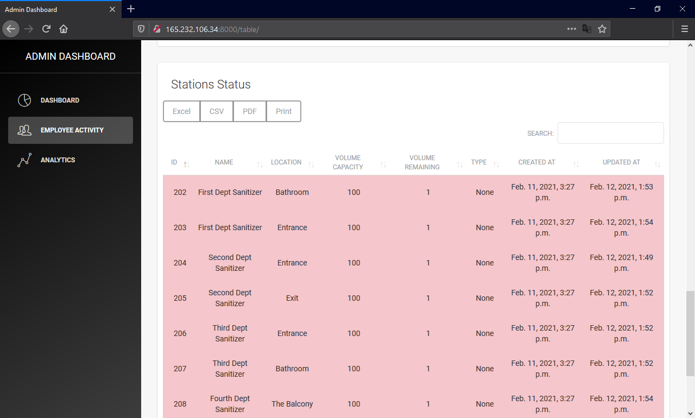

# Product Demonstration Report

Project Tersus has several elements that make up the product;
these include the sanitizer itself, the monitoring of one's own hygiene statistics, those of a collection of people, and managing the database these are all tied to.
These different elements will be demonstrated below.

## Using the Hand Sanitizer  

  

Pictured above is the casing for the hand sanitizer. Using it is incredibly simple;
First, the user - with an RFID chipped wriststrap - activates the sanitizer as they would any other automatic dispenser, as seen below.  

  
*Figure 1: The semitransparency of the front of the casing shows the hardware inside, which logs the user and dispenses the cleaning solution.*  

Upon detecting the RFID chip with the sensor seen above, the soap will then dispense onto the user's hands.  
In terms of interacting with the sanitizer itself, that's all there is to it. The hardware inside logs the information about the current dispense (how much soap was used, who the user is, and how long they cleaned their hands for) and sends this to the database where the other elements of the project can be seen.  

## Monitoring Personal Statistics

An end-user can check their personal statistics by simply logging into the website.

  
*Figure 2: The Login Screen. In this Example, the User Rachel Thon is logging on.*

After the user enters their name and password, they are taken to their personal statistics, shown below.  

  
*Figure 3: Personal Statistics shown.*

The statistics shown are live, and will reflect the current data on that person.

## Monitoring a Collection of People's Statistics

As a manager, or administrator, the user can check the statistics of people by logging in to the website in the exact same way as above.  

  
*Figure 4: An Admin Logging in with the username "dev".*

This will bring the user to a screen that offers the user a choice. Selecting "View Website" will take the user to the statistics dashboard.  
  
*Figure 5: Administrators will receive more options upon logging in.*

  
*Figure 6: The Dashboard.*

This reveals the dashboard, showing the live statistics of the entire collection of people.  
The diagrams can also provide more details by hovering over them.

  
*Figure 7: Showing the interactivity of the diagrams, with a mouse hover.*

Clicking on the Employee Activity button on the sidebar will take the user to more detailed statistics of everyone.

  
*Figure 8: The employee activity is shown here in much more detail.*  

Here, employee details are shown - the list is colour-coded according to their risk - which is determined by their hand washing activity.  
Scrolling down on the page will show the actual usage of the devices, detailing which one was used, when, and by who.  

  
*Figure 9: Showing the Device Usage, currently sorted by last used.*  

Scrolling even further down on this page reveals that the user can also see the status of every sanitizer - monitoring when they were last used and how full they are.

  
*Figure 10: Showing the Device Status, currently sorted by Sanitizer ID*  

## Managing the Database

As stated above, another option is presented when logging in as a manager/administrator. When Selecting "Account Management", the user is taken instead to following webpage.  
  
*Figure 11: Showing the database management homepage.*  

This webpage allows the administrator to create and edit users, as well as managing all other data present on the database. 

Interacting with any of the links takes the admin to the specific page and lists all data in the given table.  
  
*Figure 12: Showing the user database management page*  

From the overview of the users, an admin can access all users independently. From here the admin can change all details about the user, change the user's permissions and see the last time the user logged in to the system. The user can also be given admin privileges by ticking the staff status checkbox.  
  
*Figure 13: Showing individual user data page*  

  
*Figure 14: Showing users last login*  

At the bottom of the page the admin are given the options of deleting the user, save and add another, save and continue editing or saving. The four options are presented when editing any entry in the database.

As seen in figure 13, the password of users aren't stored as a raw string, but can still be changed by the admin.  
  
*Figure 15: Showing user password reset*  

The Users table is the only table that lists the data of every entry without having to access the entry. Every table page also gives the admin the option of creating a new type of the given model and save it in a database.
  
*Figure 16: Showing employee page*  

  
*Figure 17: Showing individual employee page*  

  
*Figure 18: Showing employee creation page*  

  
*Figure 19: Showing sanitizer page*  

  
*Figure 20: Showing individual sanitizer page*  

  
*Figure 21: Showing sanitizer creation page*  

The functionality of the two models above shows how the data is stored, and how it can be accessed and created. The other models function the same way with different data. Values like automatically incremented IDs are left out of the creation page, as these are created automatically.  
