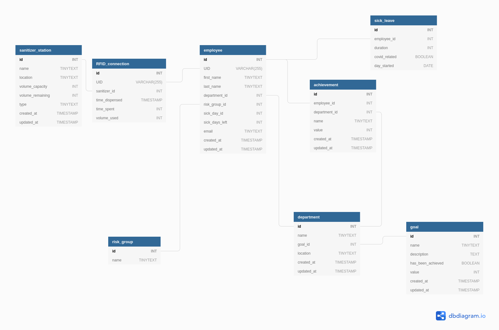

# Team Implementation Report
## Technical Diagrams
#### Figure1
  
*A circuit  diagram that shows the planned circuit for the soap dispenser.*

*A video showcasing the 3D Design of the Tersus Station, and where the components will go*

### DATABASE DIAGRAM
  
*Final database diagram*

## Technical Description
The software for Project Tersus is written in Python.
The Tersus Station (the physical dispenser itself) works on a loop;
the very first thing it does is check how much solution is remaining in the tank.
If below a certain threshold, it'll report this to management. If at 0, the program will wait until being refilled.
Otherwise, the program will wait for the detection of an RFID signal.
Upon receiving such a signal, the software logs the current time as a 'Start Time', and dispenses soap. 
This is done by activating the relevant GPIO pins on the Raspberry Pi for the servo motor (as labelled above in Figure 1) - this motor will then apply force to the pump, dispensing the cleaning solution.
Incased within the dispenser is an IR sensor - this is used to determine how long the user is washing their hands for.
When the user moves away from the Tersus Station after washing their hands, the software detects that the IR beam is unbroken,
and so then the current time is recorded as an 'End Time' - and these Start and End times are used to calculate the total time spent washing hands.
The dispenser will then send the collected information (The user ID, how long the User washed for, when they used the station, and how much soap remains) to the database through Django.

The product uses a relational MySQL database which stores all of the data. Django has a model corresponding to each table in the database which allows it to fetch queries. These queries are passed down to the html page template which display the data at the end. The tables in the database which need to be initialized are employee, sanitizer_station, department and risk_group. Each company fills this data from their own records. In the admin screen, there is a function which allows to create Django users for each employee in the database. 

## Algorithms and Data Structures

### K-Means Clustering Algorithm
The structure and main functionality of the product depends on the analysis of the data each Tersus station collects. Once gathered, the information provides huge insights into the behavioural aspects of each individual employee and how they work together in the workplace to help keep it cleaner and risk free. 

The Tersus stations collect the IDs of who washed, the length of time they sanitized their hands for, the amount of sanitizer used and the time/date that this all occurred. At initial outlook, the introduction of time-series data into the system seems to be useful in predicting the future behaviours of the workplace with autoregressive models such as an AR(1) long memory model [1[ that is capable of informing executives on hand-sanitization trends within the workplace. This had a single caveat though of requiring the data stream to have been running continuously for a predetermined set of time already before the system would be implemented.  We could provide a generated dataset with a specific distribution customized to simulate the workplace but this would be placing individuals at risk depending if the data was incorrect. Choosing between exploring the newer methods of analysis instead of exploiting the pre-existing solution we had drawn made us produce the idea of a clustering system to grade individual employees on a weekly basis. 

The K-means algorithm is implemented within python, using the pandas, numpy and sklearn libraries. We first identify the data we will be working with which would be the last months hand sanitization data, more specifically the amount of times each employee washed their hands plotted against each-other as shown in an example graph figure 1. 

The k value would be 3 for our 3 different risk groups based on compliance to the hand sanitization guidelines (“High risk”, “Medium risk”, “low risk”).  This would then select 3 random points to be picked as centroids as represented by the red points significantly larger than the rest on the figure 2 example. These random points are measured by distance to each point and closest neighbour is specified as your grouping. Once every point has a cluster, we then calculate the mean and specify this mean as the new cluster and assign every point to the closest centroid. This process is repeated until the clusters themselves do not change or a specific goal is met. Within the sklearn library the default limit is set to a high value which isn’t changed in our implementation.  In clusteranalysis.py [2] line 79; we implement the algorithm very easily with this sklearn module. We specify the number of clusters and the seed so that the same results are produced if the same data is ran through the analysis. Once the variation of the clusters is measured depending on the distribution we will run the algorithm once again. This means calculating the time taken for specific inputs is difficult but not impossible. The reason we do this is to ensure that the algorithm can represent the most 3 fairly distinct groups, if the variation isn’t correct the entire algorithm will restarted once again with new randomized starting locations. 

The input and output of this data depends entirely on the usage of a pandas data-frame data structure.  They are useful from a data analytical perspective because of the huge amount of operations that can be done. They can also easily be converted to numpy arrays which satisfy the parameters of the clustering prediction and fitting functions from sklearn. A data-frame is a structure containing rows, labelled axis and columns much like a spreadsheet would. It is an efficient data-type to calculate large statistical figures with as functions can be applied to large quantities of data quickly and efficiently.  We use data-frames in the clean-up of the collected information from as well as handling the output of the cluster analysis itself. We construct an initial data-frame using the employee IDs and washcounts on lines 71-73 of  clusteranalysis.py. We then add the collective risk groups later down on line 108 from respective lists extracted from the data-frame. 
#### Figure2

#### Figure3

### Simple Classification Perceptron
More complex manipulation of the row titles and data can also be seen in the simple Perceptron which is functioning with static data from a csv file in the QuarantineSignalPerceptron.py [3] file. This algorithm uses 3 simple inputs to calculate the immediate need to quarantine the following week from data observed from varying time-periods. The Perceptron uses 3 randomized synaptic weights stored in a matrix transposed from numpy. We then get the specified training table pre-made from hardcoded data and transpose it from a 2d array into a numpy matrix using the built in function on line 33. We specify the outputs to these in the following line 40. Each 1 and 0 signifying when a signal is on/off.  The reason behind specifying random synaptic weights is due to initially not know each weights' final value accordingly. Small initial random values will ensure that when the weights are adjusted through error back-propagation, they will reach a suitable value in the specified length of training.  We use error calculated from known data compared to our calculated answers and we adjust the weights accordingly.

The error in the algorithms case is the dataOutput minus the actual output as seen on line 52. We then run the error and the output through two separate functions.  The sigmoid function is used because it is between 0 and 1 ( an output which we can easily handle, and probabilities lie within this range) and because it is differentiable which is important to run error back-propagation through to ensure we change the values based on certainty.  Lines 26 – 30 implement this functionality, but as you can see below in the graphed functions, when the sigmoid function returns close to 1/0 (high certainty) the derivative is lower meaning the amount the weight it is shifted by is lowered. When the function returns on the middle ground 0.5 with low certainty it will return a derivative of high value ensuring the weights are changed more dramatically. This calculation is done continuously on a forloop within the code on lines 48 – 56 where we use the  dot product of the matrices and the synaptic weights to finalize the synaptic weights each turn.

The three signals used are specified in the MAgeneration.py file. The first two use data-frames to calculate a rolling average on the amount of sick days taken everyday in total on lines 38 and 39. The Moving average (ma) signals when a crossover occurs. This is where the smaller average surpasses the larger average signalling a recent trend in the data. This is significant as the 90 day moving average is a more generalised trend compared to the volatile 5 day moving average. When the shorter average crosses over it can signal a change into an increase in the amount of sickdays present. The premise is the same for the second signal which is an exponential moving average (ema). This takes into account days closer to the current day by adding an exponential weight to the days closer to present day. This is useful as present data can sometimes hold more weight and insight into future trends. Finally the difference in the gradient of high risk individuals is measured. If the increase is significant the signal is passed. Each of these will input a 0/1 into the neural network that provides a classified response accordingly.

### Big O Notation
Big O notation is hard to define for the clustering algorithm. 
Within the SKlearn library, the default iterations spent on every cluster cycle is 300. This means it runs through adjustments of the centroids 300 times to produce a variance representable for the final product which is checked as mentioned in the implementation. It will run with a different number of seeds (random initialization value) only 10 times. The algorithm defines these as constants, meaning they can be ignored in terms of the abstracted Big O notation. The algorithm will check the distance for every cluster to its surrounding points atleast once for each cluster and then recompute it for the other clusters that are defined. The polynomial representation of this equation would be:

Which is simplified via eliminating the following constants:

Meaning we can come to the conclusion, in this case the algorithm itself is linear no matter the input of sickday information (the number of employees). We can also eliminate the coefficiant completely in terms of how it doesnt affect the final asymptotic relationship in a significant way as n tends towards infinity.

An academic study on the space time complexity of the K-means Algorithm states that in order to compute the runtime complexity you need the number of iterations I, tuples N, clusters K, and time to calculate the distance of each datapoint. We can then assume the complexity is the value O(IKNT) [1]. 
Our values for iterations and clusters are both fixed. The time for calculating distance itself is also primitive assignment which can be assumed to be constant as well due to only being one simple calculation and not a function call.
This supports the conclusion that the algorithm is Big O(N) in terms of its relationship to the inputted data.

## Imported Libraries 
pandas - For the large amounts of data handling and storage within DataFrame structures.

Matplotlib - For initial analysis on online notebooks of data distribution and suitability.

Numpy - For manipulating large amounts of data quickly within dataframes and for matrix multiplication in the perceptron.

Sklearn - For implementing premade Clustering algorithms.

Random - For initializing random points for the clusters/synaptic weights to be initialized.

## Known Issues
The first known issue within the code was a bug with the initial clustering algorithm. Classifying the groups was just dependant on the variance and in turn the covariance of each group. We could have a large majourity of members abiding to the hand sanitization compliance rate and still have "high" risk individuals due to the nature of the program. This was a bug in the code due to an error in design and was eventually fixed by introducing a form of "reverse integer encoding" which would check the centrepoints of each cluster (the coordinates of the final centroids) and assign them a class based on their y values. This code demonstrating this fix is within the clusteredAnalysis.py code on lines 24 - 55. A custom function is written to implement the simple but effective label. 

Another issue by design is the clustering method 'k-means' itself. After implementation the realisation that it is a hard-cluster algorithm, in the sense that when given data it will always find 3 distinct groups, was found to be a downside. Even if employees washed their hands they could move up/down risk groups, but there would always be a "high" "medium" and "low" group present due to the nature of the algorithm. One way in the future of fixing this problem would be to use these models and combining them into a form of stacked classifier that outputs to another neural network much like the perceptron. Instead of only being one layer this could be multiple, allowing for a more precise and range-based output. We could have three measurements of high/med/low and provide the weights or chance that the individual belongs to once group. Tagging the individual with the likeliest outcome would be a method in classifying them. This way we could use the original technologies and implement the new method where the old k-means algorithm was found before without the hassle we faced beforehand with continous framework bugs.

## References

[1](https://www.ripublication.com/gjpam16/gjpamv12n5_41.pdf) - Time Complexity of the K-means algorithm, page 4412 (8 of 14)
