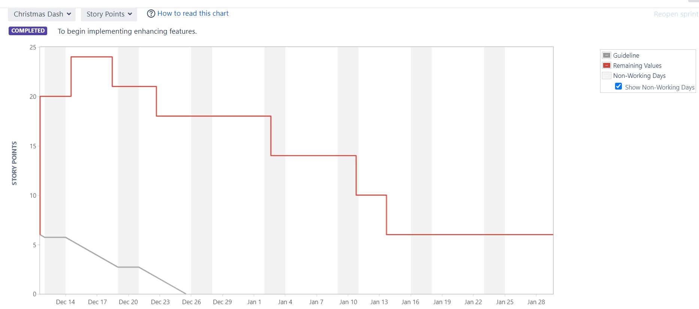
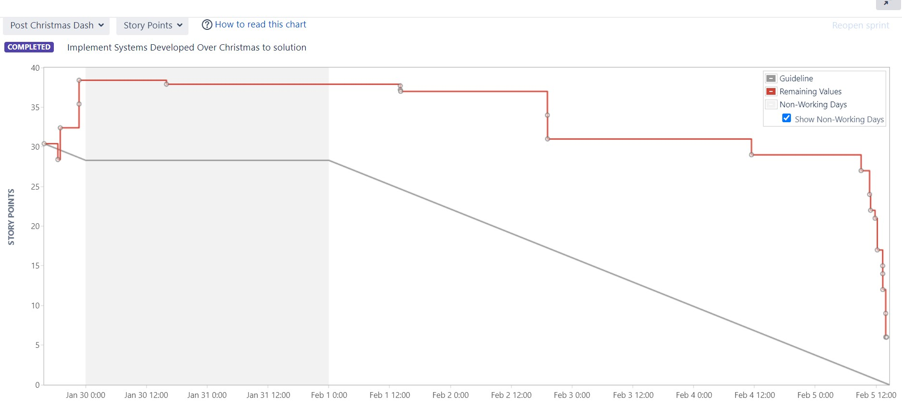
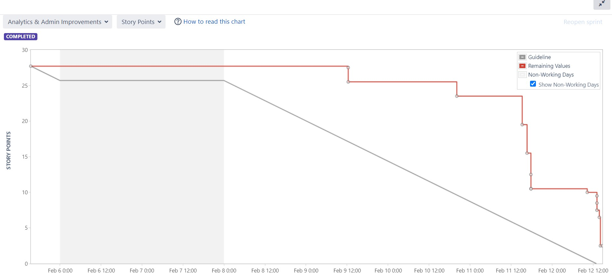
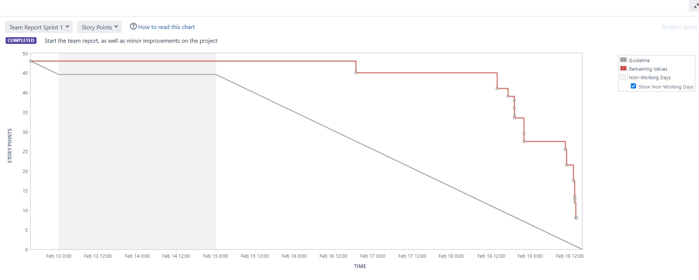
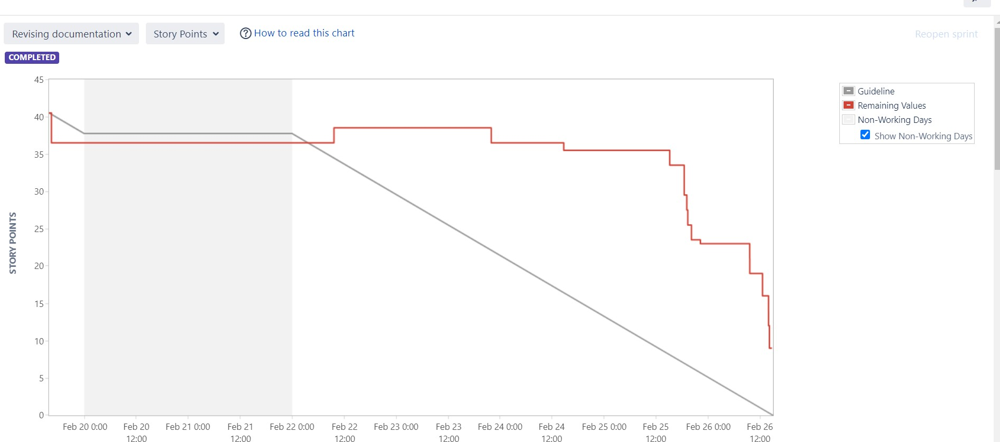
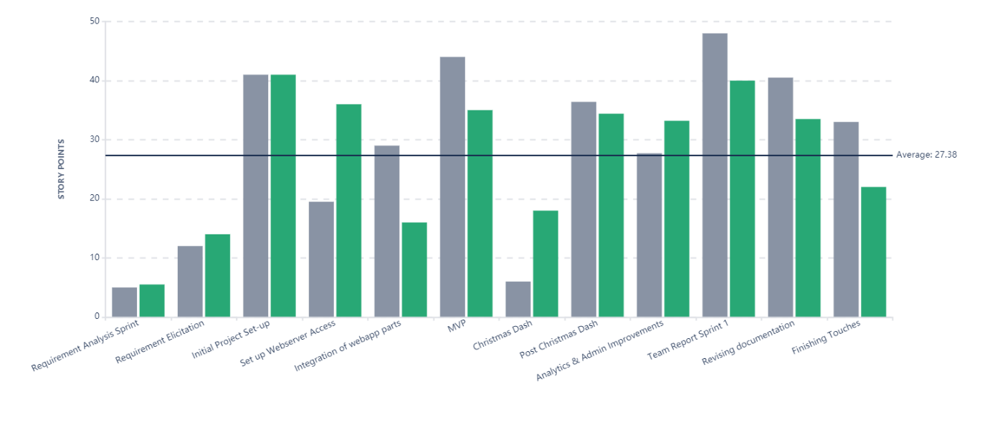
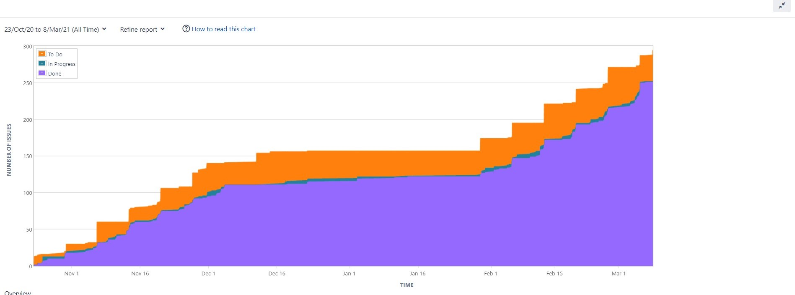

# Project Management Log

## Project management discussion
Though the ambition of new teams in the computing field is their strength, it is also commonly their ‘Achilles heel’ leading to the self-destruction of fresh ideas. Young and intelligent minds whose aims are set too high, failing to meet those expectations due to the one limitation of not having the experience to know what is viable within the given deadline. Companies report only 64% of projects meet their goals and as cited 70% of those companies report having failed at least one project per year [1]. This shows that the rigidity of a structure within the development cycle is paramount to the successful shipment of the product. Chapter 8, New Project development [2] states that “Successful new product development is a critical cornerstone of firm success” which means finding the best system to manage the resources and time of the team would be the determining factor of whether the project was a pass or fail. Team 5 was fully aware of this risk and from an early stage set out to ensure development was not hindered by miscommunication or lack of experience in the field. We devised a system for scrums, cooperative work, the exchanging of information and understanding of the individual components that make the whole product function.

To begin with, we clearly stated the roles of each team member on the frontpage of our Gitlab repository. This was a strong resource for each member to familiarize themselves with who would be doing specific workflows within the team.  The order of the table also dictated the scrum leader for each of the following weeks. It would iterate through each member and provide a chance to let them talk and decide specific tasks to be given priority. The team ensured that each voice would be heard no matter who was the scrum leader at that given meeting. This use of a rotational position of authority ensured that the team worked as a collective rather than a group of individual members. We heeded the advice of Aristotle who once said that “The whole is greater than the sum of its parts”. 

When the project had an offline component that needed to be integrated to the cloud system, it would need the full force of two members to dictate the inputs and outputs needed by both parts. We ensured that a standard of commenting and communication on multiple channels ensured that we could combine the pieces together to form a fully fledged product. There were multiple occasions, like this, where members would need to work together in pairs as well as separately and the coordination of this consistent method of presenting information to one another through lines of commented code was useful for reaching the desired outcome. 

Throughout the development, it became obvious that specific members were more familiar with the components they had designed and brought to fruition. For example, members who had installed and ran the VPS server were proficient with the framework we used to get python to display data in a JSON file to the website. As a collective, we each had a fragment of the entire picture and our views of the other aspects of the project could sometimes be abstracted due to us working on a specific part for prolonged periods of time. This was why the scrum meetings were of huge significance to maintaining the integrity of communication. Aside from assigning tasks to each member(in order of the afore-mentioned table) we would sign off their weekly contributions and how it helped to propel the project closer to our destination goal. This brief overview of each component ensured that every member was on the same page, no matter the stage or their own contribution to the project.

After the MVP deadline, the team continued developing new features for the cloud application and researched advanced topics for the product. This included productization and how we would be presenting the system as a subscription-based package, security with ensuring our storage of employee’s personal information was not subject to a liable case and the physical hardware design of the device and how the individual components would function together. 
During the winter break, development was pursued in individual tasks. Everyone was assigned workflows according to their preferred area of expertise. The goal of the winter sprint was to prototype individual technologies and ideas that we could incorporate together once the second term started again. This stage of development was at the precipice of the ‘performing’ stage of team formation. As described in [3] performing is the stage at which “Hard work goes hand in hand with satisfaction about the teams progress”. We were successful with our MVP presentation, seemingly leaving a good impression on the stakeholders. From this stage, initial ideas and tests to improve the product involved an extended database, a login and an email warning system and gamification features. In the following sprints, team members worked together integrating different pieces of the puzzle with the web application. As the features were developed, the website received new pages such as 'Employee activity' and 'Analytics' that provide an insightful representation of the current situation of the organization/company.

A major improvement on the project management side is the frequent use of Risk and Bug type issues on Jira which led to a better understanding of the limitations of our solutions and a more efficient error solving. In each weekly scrum meeting, the team members discussed and analysed their individual issues and worries as well as proposed potential solutions or requested help from fellow colleagues. Since November 2020, the team became familiar with Jira tools and functions which resulted in a more efficient issue creation, task assignment and a clearer view of the project's workload.  We also used the Epics feature to detail what component each task in the project was contributing to. An example of the Epics used are shown below with the screenshot. We colour-coded each task and story specifically to ensure we completed the highest priority sections first and satisfied the stakeholders at the same time. 

*Figure 1: Showing the Epics used as colour-coding system for issues.*

Through this systematic approach, we tackled the problem of an ambitious idea being realised in a heuristically and exploratory manner. Once we found our correct path to follow to success, we utilized it fully to lead us to where we are today. 

## Sprint Burndown Charts

*Sprint 7 - Christmas Dash*

*Figure 2*  

*Sprint 8 - Post Christmas Dash*

*Figure 3*  

*Sprint 9 - Analytics & Admin Improvements*

*Figure 4*  

*Sprint 10 - Team Report Sprint 1*

*Figure 5*  

*Sprint 11 - Revising documentation*

*Figure 6* 

## Burndown-Charts Discussion
The sprint burndown chart makes the work of the team visible. It is a graphic representation showing the rate at which work is completed and how much work remains to be done. The chart slopes downward over sprint duration and across story points completed. What makes the chart an effective reporting tool is that it shows team progress towards the sprint goal, not in terms of time spent but in terms of how much work remains.
The team might improve on task estimation and logging worked time.

* Velocity chart

*Figure 7*

* Cumulative Flow Diagram

*Figure 8*
## Product Backlog

The image below shows what a backlog would look like during a normal sprint week. We colour-code each task based on the component of the project it is related to. These include Front/Back-end, Serverside, Database, documentation and productization among others. This was useful for when you needed to look at your own tasks to get an idea of the different toolsets you will need to work on different components. Individuals also had a specialization/preferred role within the group and were given tasks based on their preference and skillset as stated in the table mentioned above.

*Figure 9: Backlog during normal sprint week.*  

## Sources
[1] [Complete collection of Project Management Statistics](https://www.wrike.com/blog/complete-collection-project-management-statistics-2015/#failure)

[2] [New Product Development* by John R. Hauser, MIT, and Ely Dahan], Introduction pages 1,2

[3] [Tuckman (forming, norming, storming, performing)](http://www.mspguide.org/tool/tuckman-forming-norming-storming-performing)

