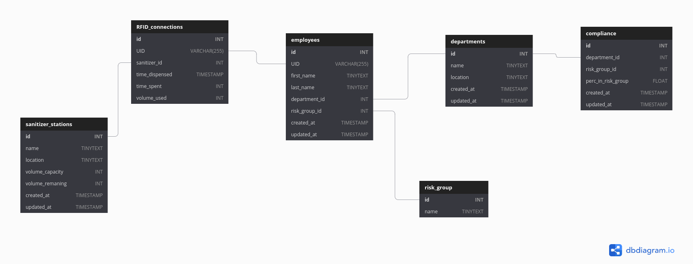

# Product Demonstration Report

Team 5 have developed a smart real-time hand hygiene tracking system. With a network of connected hand sanitisation stations, team members can analyse their staffs cleanliness.

This is achieved through a back-end analysis using clustering with a front end website displaying the data in a clean, easy to use dashboard.

The data starts by being collected at a hand sanitising station, for testing purposes we have simulated this via a Raspberry Pi.

The Raspberry Pi simulates hand washes on a timer and sends the data to the Django back-end via a Post request.

Once the data is received by the Django server, it's passed onto a MySQL database to be stored, this includes the `sanatizer_ID`, `time_dispensed`, `department` etc.

Once the database has stored the required data, the Django front-end can access the data every time the page is refreshed. 

On refresh, the data is passed on to a clustering method, this outputs the results into a JSON format for `Chart.js` to interpret and display in an easy-to-use format.

The backend system also includes an admin panel to allow system managers to login, view and manipulate the MySQL Database directly.

