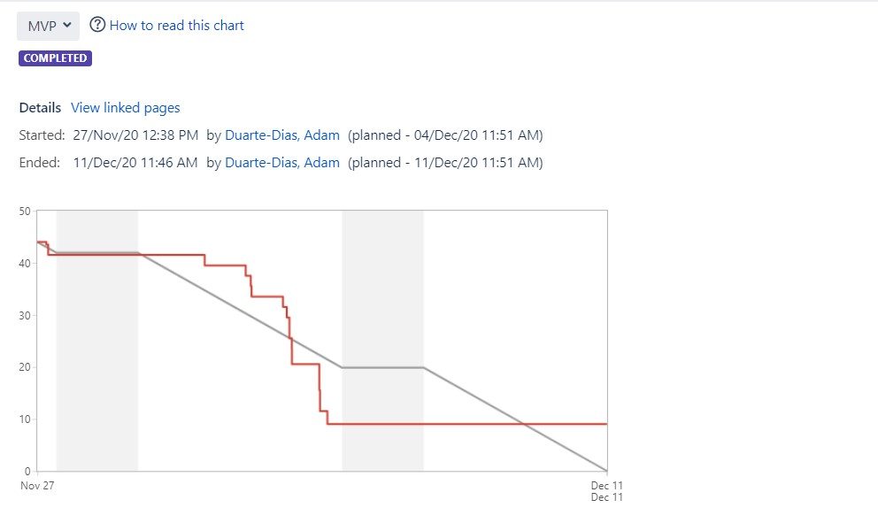

# Project Management Log

## Project management discussion

Since the start of the project, our team performed efficiently and managed to accomplish all of its weekly objectives. In the beginning, every team member got to know others strengths and abilities, in order to attribute tasks in the future. Multiple approaches and possible solutions based on individual research were discussed in the weekly scrum meetings and noted down in Jira. Taking into account the guidelines offered by Mr.Dick Wallis and our supervisor, Jameel Shoaib as well as individual experience and competency of different programming languages and frameworks, the team has decided on collecting data from hand sanitizer stations using employee RFID cards and displaying analytics regarding hand hygiene performance through a website. 

Real, documented progress was made by the team as each member was contributing to on one of the following product’s subsections: Data Analyis, Data simulation, databases, Django administration and front-end web development. Collaboration and productivity are some of the strengths of this group as everyone delivered their tasks on time and put their best effort while asking for help when needed. Adopting the agile methodology, weekly scrum meetings were held to review team’s performance and discuss the next stage of product development. The scrum master is changed every meeting and is in charge of creating/assigning tasks and creating the sprints in Jira. On GitLab, a clean and well-maintained repository is continously updated and members can easily access all the project files and make their contributions to the project.

Overall, the team performance is good and the project seems to progress as expected, which leaves a lot of room for improvement. 

## Sprint Burndown Charts

*Sprint 1 - Requirement Analyis*

*Sprint 2 - Requirement Elicitation*

*Sprint 3 – Initial Project Set-up*

*Sprint4 – Set up a Webserver*

*Sprint 5 - Integration of webapp parts*

*Sprint 6 - MVP*

## Burndown-Charts Discussion

The sprint burndown chart makes the work of the team visible. It is a graphic representation showing the rate at which work is completed and how much work remains to be done. The chart slopes downward over sprint duration and across story points completed. What makes the chart an effective reporting tool is that it shows team progress towards the sprint goal, not in terms of time spent but in terms of how much work remains.

* The team might improve on user story allocation and task estimation.

## Product Backlog

Current product backlog

## Other Areas

On Jira, we have created 8 active epics in order to efficiently manage tasks. On GitLab, we tried implementing a pipeline but didn't succeeded as it is an advanced tool we don't know have experience with .
* Link to Jira Epics: https://cseejira.essex.ac.uk/browse/A299109-113?jql=issuetype%20%3D%20Epic*
