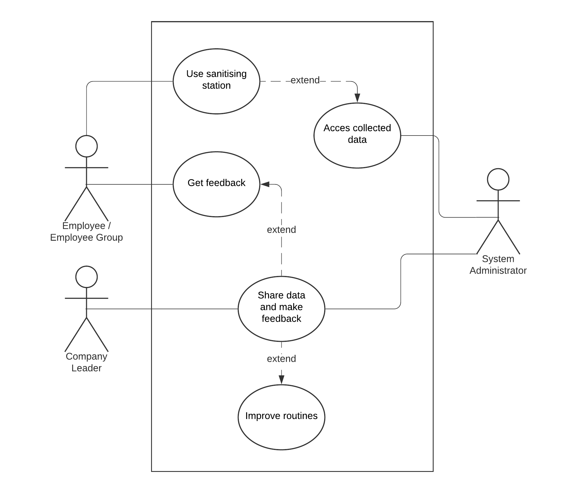

# Requirements and Risk Log

## Requirements

### User Stories:
**Functional:**

[Joanna:](https://cseejira.essex.ac.uk/browse/A299109-135)
> As Joanna, a manager seeking to improve hygiene in the company, I want to be able to see how my employees are performing in their hand washing. 
> I need to be able to see if anyone is in particular need of improving, whether by deparement, location, or by individual.

**FR1** - The system must be able to show performance statistics of employees.

This story has not been assigned to anyone - it involves aspects that everyone has been working on.
It is complete - Joanna could look up specifics about people and where the worst areas are.

[Jenny:](https://cseejira.essex.ac.uk/browse/A299109-134)
> As Jenny, an employee using the sanitation station, I want to be able to be proud of how good I am at washing my hands, and be able to look at how well I am doing.
> I would like feedback as to how I could improve.

**FR2** - The system must allow for users to see their own statistics.

This story has not been assigned to anyone - it involves aspects that everyone has been working on.
It is not complete - Jenny cannot currently look up her personal hand-hygiene statistics.

[Joe:](https://cseejira.essex.ac.uk/browse/A299109-137)
> As Joe, refiller of dispensers everywhere, I must know when the dispenser is empty or close to empty so I can fulfill my calling.

**FR3** - The system must be able to detect the percentage of content in the dispenser, and report it.

This story is assigned to Adam, who was in charge of coding the simulation.
It is complete, in the simulation the saintizer can detect when it is empty and send messages to the database.

[Jade:](https://cseejira.essex.ac.uk/browse/A299109-136)
> As Jade, an Early Investor looking to potentially back the hardware financially, I want to be able to see a simulation of the hardware in question.
> I want to see that it can react correctly to simulated inputs and create comprehensible data from this.

**FR4** - The MVP of the system must accurately simulate aspects of the final product.

This story has not been assigned to anyone - it involves aspects that everyone has been working on.
It is completed - this is the MVP. A simulation of aspects of the hardware are running on the base board - and with random events to simulate employees using the dispenser, data that can be analysed and viewed has been created.

**Non-Functional:**

[Jeremy:](https://cseejira.essex.ac.uk/browse/A299109-133)
> As Jeremy, an employee of the company using the sanitization station, I want to be able to clean my hands with minimal fuss.

**NF1** - The dispenser must be quick to react to user input and not require further interaction.

This story has not been assigned to anyone - this story requires the hardware to be finalised.
It is not complete - Hardware is required to make this work. For the MVP, simulations mean that a simulated Jemery could simply tap his card against the dispenser to wash his hands with minimal fuss.

[Jessica:](https://cseejira.essex.ac.uk/browse/A299109-138)
> As Jessica, a potential buyer of the product - I need to be able to access the information the system creates on any device.

**NF2** - The system must make the data analysis be viewable on a webpage.

This story has not been assigned to anyone - it involves aspects of the system that multiple people have worked on.
It is complete - data analytics of the database can be viewed from a website, and thus any device.

[Use Case Diagram:](https://cseejira.essex.ac.uk/browse/A299109-23)

[Requirements List:](https://cseejira.essex.ac.uk/browse/A299109-22)
[Requirements List Document on Git](../project%20specification/ProductRequirements.md)

### Risk Log

[Data Data Analytics file not tested with django requests](https://cseejira.essex.ac.uk/browse/A299109-109)
> Need to test if django request and send will work with clusteringAnalysis.py file on website

This risk has been assigned to Arif. The actions taken by Arif to mitigate and address this risk are by testing the request.

[The Database Could Fail Under Heavy Load](https://cseejira.essex.ac.uk/browse/A299109-139)
> With too many connections to the database, either inserting or retrieving data, the database might fail under a load that is too strenuous.
> 
> Test for both if possible. Simulatenous simulations running at the same time, with a lot of request.

This risk is assigned to Samuel. The actions taken to mitigate include following the suggested tests.
It is not yet possible to determine whether the action is complete or whether it can realistically be ignored.

[The Website Might not Display the Correct Information](https://cseejira.essex.ac.uk/browse/A299109-140)
> The website is supposed to keep a cache of requests so that the database is not put under too heavy a load when it is requested. It is possible that the website might display incorrect information - or that the website might not work.
>
> Once the data is all in place - test whether the website/database can handle the strain and if possible compare the data on the website with the data from the database.

This risk is assigned to Hazim. The actions taken to mitigate include following the suggested tests.
It is not yet possible to determine whether the action is complete or whether it can realistically be ignored.

[The MVP isn't ready for the deadline](https://cseejira.essex.ac.uk/browse/A299109-84)

This risk has not been assigned to anyone as it involves everyone. At the time of writing, it is not yet completed until the MVP is finished.
Current mitigations have been taken by meeting each Sprint's activities and deadlines on time. Everything is moving on schedule.

[The full project isn't finished before the deadline](https://cseejira.essex.ac.uk/browse/A299109-85)

This risk has not been assigned to anyone as it involves everyone. At the time of writing it is not yet possible to complete this.
Current mitigations have been taken by meeting each Sprint's activities and deadlines on time. Everything is moving on schedule.
