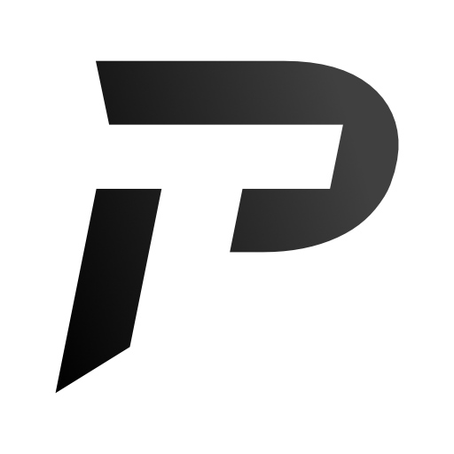

# Productisation

- [Branding](#branding)
- [Pricing](#pricing)
- [Manufacturing](#manufacturing)
- [Distribution](#distribution)

## Branding
### Name
We decided to name our product 'Project Tersus', drawing from the latin word '*Tersus*' meaning 'Clean'.

### Logo

### Icon

### Colour Scheme
???

## Pricing
Need costing of hardware, not urgent

## Manufacturing
Waiting on hardware blueprint, not urgent

## Distribution
We are working towards providing a service where our aim is to implement and distribute a network of hand sanitisers around a building where hand hygiene is crucial to everyday operation.

### Current Implementation
Currently we have the main function of the system implemented on a VPS provided by Digital Ocean. This was built with scalability in mind so we can slow build up a portfolio of businesses interaction with the product.

We can also provided a self hosted, closed, private installation if the client requests so. This would come at an initial one time added cost, however in the long run, the client could save money implementing it in their own servers. It would also provide peace of mind as they can ensure their own user data is under control.

The current physical product is implemented via a RaspberryPi 3 hooked into an already existing hand sanitising system.

### Future Implementation
To provide an easy to install product, we would look at a self sustainable, energy regeneration system where we can capture wasted energy (in the hand pushing motion) to provide an electric current to an ultra low power chip that will ping a hub with the relevant information. However, this will drastically increase cost of the product.

We would also look at manufacturing our product alongside a hand sanitiser system to provide an all-in-one unit that can be installed with ease, no cable installation needed.