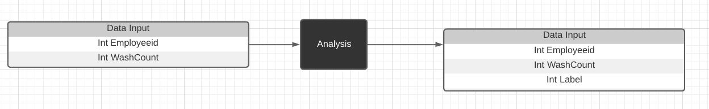
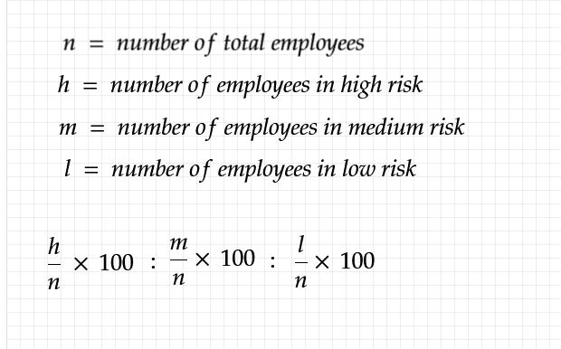
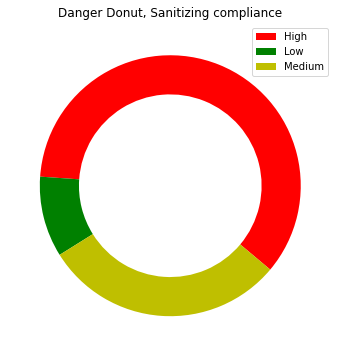
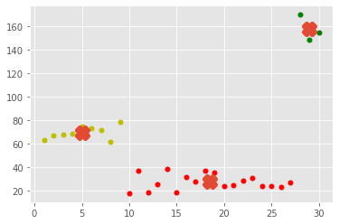
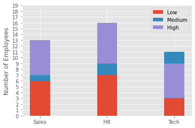
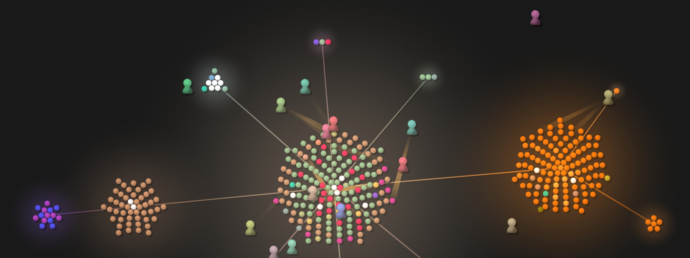
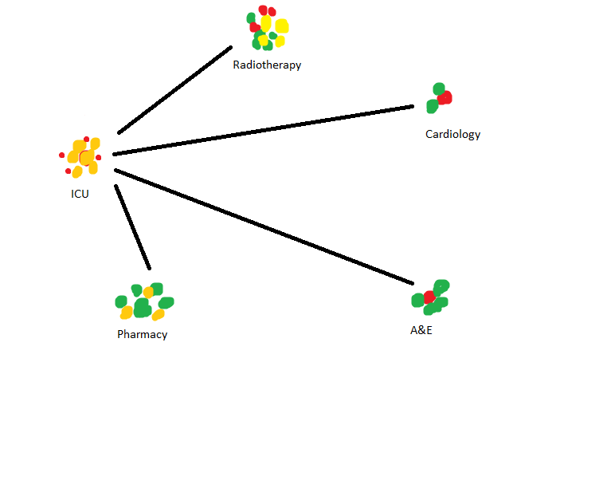

## Viable metrics

Using data collected from the analysis and RFID chips we can provide useful metrics for the system. These will be part of the solution that aims towards changing behaviours of the employees. They will also provide a good idea to executive positions in the companies to what is causing an increase/decrease in paid sick leave and how to avoid infection spread throughout the company.

## Input/Output Of analysis variables

The input/Output of the data should be shown as:

# Overall Risk factor
The first display metric is an overall 'risk' factor based on the proportion of employees in the high/medium/low risk catergories. These are decided by the clustering algorithm that will specify the outliers and employees who do not sanitize their hands in compliance. 

To calculate this we would use the total counts gained from the kmeans algorithm and the total number of employees;

It could be displayed in a colour format with high/Med/low risk being red/yellow/green colours.
The display would be in a ratio of 3 percentage values.

# Danger Donut

The second display metric would be a donut chart displaying the proportion of high/medium/low risk employees in the entirety of the company. This would be a better visual indication for how the company itself is doing and would be a useful indicator on the hand sanitization compliance rates.

This uses the data shown below which was classified using a kmeans algorithm.

# Stacked Barchart

The third display metric would be a stacked Barchart which could display the proportion of members of specific departments within the company, and which risk division they belong to.

This would be able to show specificially how each department is performing. In order to help not make any employee specifically vunerable you only get an overview of all members and how they are performing.

# Analytics Page

For the analytics page, a clean representation of the company in terms of the risk of spreading diseases should be present to show how individuals are performing. This should be done without exposing them specifically. One method of doing this is representing the collective and its different departments in a tree format.

This image shows a github repository with users adding and making changes to the files. Each branch represents a new directory and each leaf is a file within. This could be implemented to show a similar diagram for the company. Each department could be its own seperate branch and each connection could show how they are linked. We could show every employee anonymously and have pointers towards every department showing the amount of linkage between departments. These links themselves could have weights depending on the proximity and spread chance between these locations.

The image below shows how the model would represent the barchart information in a more simple method. 

As you can see, the departments will have individual employees with their risk factors. The lines to each and every department will show the weight or risk to between every department based on geographical proximity or other indicator. We could use a machine learning algorithm to identify the weights between the departments and how much they will affect eachother.

### Requirements
When you click on a department it should highlight only the relationships between it and other departments.
Each node in the graph should display employees and their risk group.
Weights should represent risks that departments have to other departments.
