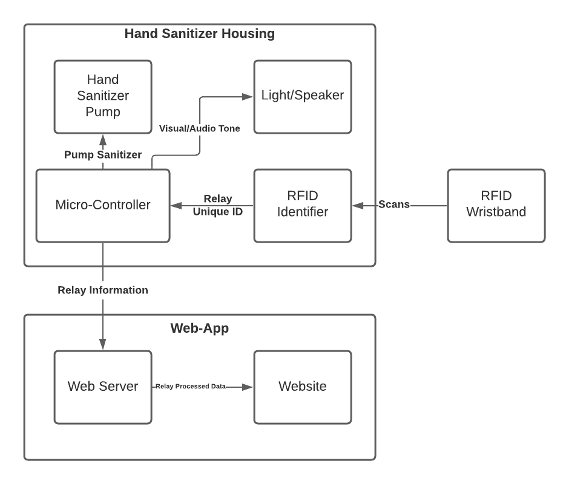

# Intelligent hand hygeine compliance system

## Components

- RFID ID card / RFID wristband
- Hand sanitizer unit
	- housing
	- pump
	- microcontroller
- Database
- Web Server (processing)
- Website (front end)

## System Architecture

## Minimum Viable Product

- System distinguishes between different IDs (doesn't matter whether it is from RFID card, RFID wristband or other form of identification)
- System is able to recieve data from mulitple sources (locations)
- System stores data in a database
- Data can be accessed from the database
- The system does some sort of statistical analysis on the data (could be simple operations such as averages)
