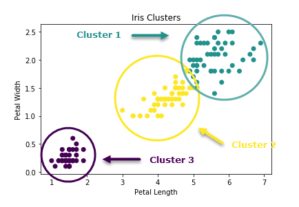

# Analytical Research

Depending on what data is collected we have several methods of analysis that can be done to add aspects of an intelligent decision making system into the solution. The goal would be to have a set time prediod of data which could be analysed and the employees can be categorized as high/Low risk. This could also take the form of an overall 'threat' level which is displayed on the website's dashboard.

## The data
What format the data itself will be in is significant. This is because Numerical and categorical data are treated differently and work better in respective models. For our solution we will be obtaining ID's of employees washed and the data about when and maybe where they wash their hands. THis could be defined all as continous numerical data which would work well in a **clustering** method.

EmployeeID | Time Washed | Day Washed | Month washed
------------ | ------------- | ------------- |------------- |
1 | 13 | 8 | 4 |
2 | 14 | 8 | 4 |
1 | 16 | 8 | 4 |
2 | 19 | 8 | 4 |
2 | 20 | 8 | 4 |
3 | 8 | 8 | 4 |

The method of analysis would look at the given data and be able to categorize certain users into specific high/med/low risk areas. The parameters of these divisions would be in compliance with the WHO guidelines on handwashing as shown [here](https://apps.who.int/iris/bitstream/handle/10665/44102/9789241597906_eng.pdf;jsessionid=765B6697D38A64E0BB1B6BB5AB064434?sequence=1).

An example of the analysis done here would be being able to differentiate that EmployeeID 3 is in a high risk area whilst 2 is safe and 1 is medium. Categorising these employees by ID and alerting execuitives or the individuals would allow for a behavioural change. We could also total the amount of employees in individual sections and display it in a visual manner such as an overall % 'threat' level. 

## Clustering analysis
One method of analysis which could be applicable in this aspect is clustering. This is where algorithm looks at data and the relationships/similarities between points and groups the data based on 'clusters'. The developer specifies how many clusters there would be in the outcome. This means from our example we can specify 3 groups according to high/medium/low risk and then analyse a weeks worth of data to see if behaviour or compliance levels would need to change.

This example shows how three distinct groups are differentiated between eachother in a simple clustering method.

Using Kmeans as a method of clustering we can specify the amount of clusters we want. It places the centroids at random locations and repeats for all points close by (minimum distance) finding the centroid between all points specified by the amount we of clusters we give. This is repeated until defined groups are found. Below is an example of using the random number generation (where specific bias has been inputted into the data) and we use it to disginguish between 2 categories of high/low risk employees.

And afterwards the simple Kmeans algorithm with centroids visible: 

This shows viable use in classifying members/employees within the company easily and quickly with a well defined model and parameters.A more updated version in use is shown below with more IDs and employees simulated. This again uses well defined clusters with predetermined 'company departments' for the metrics later in analysis.

# Data Simulation

The problem with simulating data in the method currently used is that the probability of each outcome occuring is equal unless artificially modified like what has been done with the current DataGeneration.py method.
This means that even though the classifier will work on the data provided, in a *real* world scenario it is unsure if it could still classify employees into specific groups as the data we are using doesnt simulate the real world accurately.

The data within the real world would have some form of basic trend that could be implemented into the analysis. Currently with the way we randomize data people are sanitizing their hands all hours of the day. This is not simuated as people are more likely to wash their hands on their break/lunches where they are allowed to goto the toilet etc.
One way of avoiding this is by normalising the data where certain events are less likely to occur than others rather than the probability of all events being uniform. This can simulate an alternative dataset that can be used to test the robustness of the model. 

A stretch goal would be to have seperate datasets for hospitals, office-spaces and factories to be able to see how the same algorithm will function with drastically different datasets and figures.

